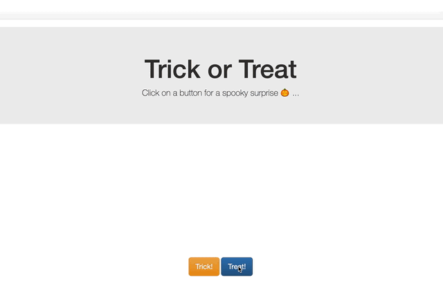

# Trick or Treat

A spooky little project that was made in an hour for my son. Check it out here: <https://stevemar.github.io/trick-or-treat> or in GIF form below.

## About the code

It's just some HTML and Javascript. Nothing fancy as I wanted it to be served on GitHub Pages. Click on a button to set the image source and visibility. [Bootstrap](https://getbootstrap.com/) was used so I could just pull in a decent looking theme easily.

## License

This code pattern is licensed under the Apache Software License, Version 2.  Separate third party code objects invoked within this code pattern are licensed by their respective providers pursuant to their own separate licenses. Contributions are subject to the [Developer Certificate of Origin, Version 1.1 (DCO)](https://developercertificate.org/) and the [Apache Software License, Version 2](https://www.apache.org/licenses/LICENSE-2.0.txt).

[Apache Software License (ASL) FAQ](https://www.apache.org/foundation/license-faq.html#WhatDoesItMEAN)
